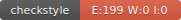

## Etudiant 
Abdou NIANG
## Groupe 
ILSEN-IA-CLA

## badge pour CircleCI 

Cette erreur est du lorsque j'essaye de mettre le clé privé et public pour javadoc. je dois donc la corriger sinon tout ce passé bien

## badge pour la couverture de test

##  CheckStyle

